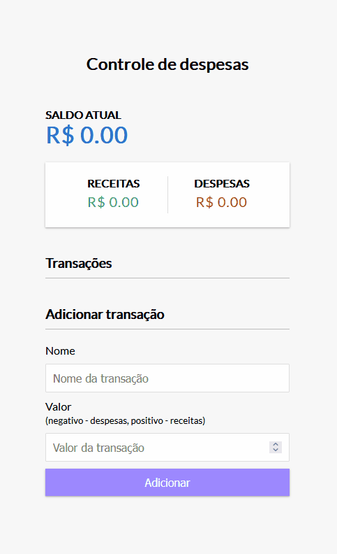

# Expense Control

### About project

This is a financial control system for recording income and expenses. 
All records are stored in the browser's localStorage, so they remain saved even if the page is reloaded.

### Aplication link

Link: <a>https://jx-expensecontrol.netlify.app/</a>

## 👨‍💻 Technologies
Technologies used in the project:

